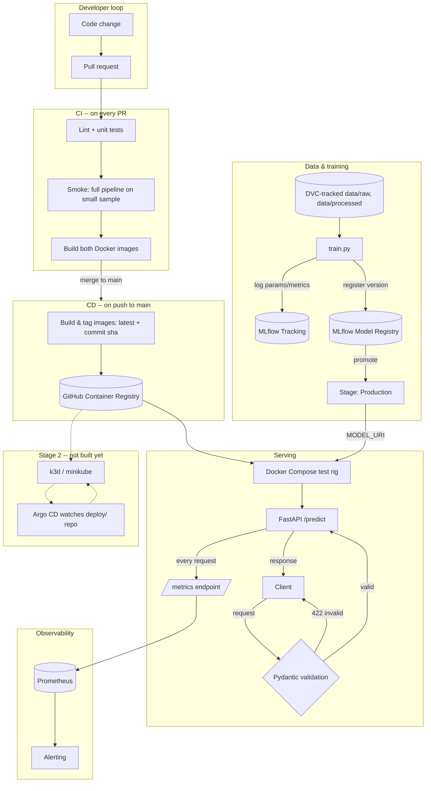

# Architecture

This document explains what each piece of `mlops-mini-lab` does, why it
exists, and how the pieces connect. The model itself (a toy
`RandomForestClassifier` on synthetic data) is intentionally
uninteresting — the point of this repo is the plumbing around it: data
versioning, experiment tracking, reproducible pipelines, containerized
training/serving, and an automated CI/CD flow. That plumbing looks the
same whether the model behind it is a toy classifier or a real
production model.

## End-to-end flow



## Components

| Component | Problem it solves | Key question it answers |
|---|---|---|
| DVC | Git handles code well, large data poorly | "What data produced this model?" |
| MLflow Tracking | Experiment runs get lost, hard to compare | "What params/metrics did run #47 have?" |
| MLflow Model Registry | Serving is tied to a local file on disk | "What model version is live, how do I roll back?" |
| Docker / Compose | "Works on my machine" | "Is the environment the same everywhere?" |
| GitHub Actions CI | Bugs reach `main` unnoticed | "Did this PR actually break anything?" |
| GitHub Actions CD + GHCR | Manual deploys aren't reproducible | "What image is live, and where did it come from?" |
| Pydantic validation | Garbage input crashes the model with a cryptic error | "Is this request even well-formed?" |
| Prometheus metrics | Logs don't scale to "is the service healthy" | "Is the service degrading right now?" |
| (stage 2) k8s + Argo CD | Compose doesn't self-heal or scale | "Who restarts this at 3am if it crashes?" |

### DVC -- data and pipeline versioning

Git is bad at storing large binary data: a 500MB dataset committed and
later deleted still bloats `.git` forever. DVC stores a small pointer
file (a content hash) in Git and keeps the actual data in a DVC
"remote" (local cache, S3, GCS, ...) -- the same content-addressable
idea Git itself uses for blobs, just applied to data and model
artifacts.

`dvc.yaml` describes the pipeline as a DAG:

```
make_dataset -> prepare -> train -> evaluate
```

Each stage declares its `deps` (inputs) and `outs` (outputs). `dvc
repro` hashes the inputs and skips any stage whose inputs haven't
changed -- the same idea as `make`, applied to data instead of object
files.

**Concrete use cases:**
- Roll back to a previous code commit -> `dvc checkout` restores the
  exact data that was current at that commit.
- Change one line in `prepare.py` -> `dvc repro` only re-runs
  `prepare`, `train`, and `evaluate` -- `make_dataset` is untouched.
- A teammate clones the repo -> gets code and structure instantly,
  pulls data only when actually needed (`dvc pull`).

### MLflow Tracking -- experiment history

Every `train.py` run logs its hyperparameters, metrics, and the model
artifact itself to MLflow. This answers "what happened during
experimentation" -- the historical record. Without it, comparing two
training runs means digging through print statements or,
worse, memory.

### MLflow Model Registry -- what's live right now

Tracking answers "what happened"; the Registry answers "what's
running in production right now". A registered model has named
versions, each of which can be moved through stages (`None` ->
`Staging` -> `Production` -> `Archived`). The serving layer asks for
`models:/mlops-mini-lab/Production` instead of a hardcoded file path
-- MLflow resolves which version that currently points to and fetches
its artifact, wherever it's stored (local disk, S3, GCS).

**Concrete use cases:**
- A model starts degrading in prod -> `mlflow models transition-stage
  --stage Archived` on the current version, `--stage Production` on
  the previous one. No rebuild, no redeploy of the image.
- Canary rollout: one instance of the serving service points at
  `Staging`, another at `Production`, traffic is split at the load
  balancer.
- Audit trail: MLflow's UI shows the full history of stage
  transitions -- "what was in Production on March 15th at 2pm".

### Docker / Docker Compose -- environment isolation

Two separate Dockerfiles (`Dockerfile.train`, `Dockerfile.serve`) is a
deliberate split: training is CPU-heavy and runs occasionally, serving
is I/O-bound and runs continuously. Bundling them into one image would
drag training-only dependencies into the production serving container.

`docker-compose.yml` orchestrates three services locally: `mlflow`
(tracking server), `train` (a one-off job via `--profile train`, not
a long-running service), `serve` (the always-on API). This is a
scaled-down version of what Kubernetes does in production -- without
autoscaling, self-healing, or multi-node scheduling.

### GitHub Actions CI -- the quality gate

Runs on every PR: lint, unit tests, a smoke run of the full pipeline
on a small sample, then a build of both Docker images (no push). If
any step fails, the PR shouldn't be merged (enforced via branch
protection). This is the gate that keeps `main` always deployable.

### GitHub Actions CD + GHCR -- the deployable artifact

Runs only on push to `main` (i.e. only after a PR has already passed
CI). Builds and pushes images tagged both `latest` (floating) and
`<commit-sha>` (immutable). The SHA tag is what gives traceability --
looking at a running container's tag tells you exactly which commit
produced it, and `git diff` between two SHAs shows exactly what
changed between two deployments. This reflects the "build once, deploy
many times" principle: the artifact is built once at merge time, then
the same immutable artifact is what moves through environments.

### Pydantic validation -- fail fast at the boundary

`conlist(float, min_length=N, max_length=N)` isn't just a type hint --
FastAPI executes it before your endpoint code runs. A malformed
request gets a `422` with a precise description of what's wrong,
instead of a `500` from deep inside scikit-learn. A custom
`field_validator` additionally rejects `NaN`/`Inf`, which are valid
`float` values but nonsensical model input.

### Prometheus metrics -- observability

`prometheus-fastapi-instrumentator` exposes `/metrics` with
`http_requests_total` (by handler and status code) and
`http_request_duration_seconds` (a latency histogram). Prometheus
scrapes this endpoint on its own schedule (pull, not push) -- the
service doesn't need to know Prometheus exists, which keeps it simple
and resilient to the monitoring stack being down.

## What this repo trains

Not "how to train a RandomForest" -- that part is assumed. What this
setup actually exercises is four engineering habits that separate an
"ML script" from an "ML system":

1. Separating a step from its result -- code (`train.py`) is separate
   from the artifact (a Registry version), which is separate from
   what's actually deployed (`Production` stage).
2. An automated quality gate before merge, not "it worked on my
   machine, ship it".
3. Immutable, traceable artifacts (image tagged by commit SHA) instead
   of ad hoc changes on a server.
4. Observability as part of the service's contract, not an
   afterthought.

None of these four are ML-specific -- they're the same fundamentals
that apply to any backend service, which is why this exercise
transfers well beyond one toy model.
